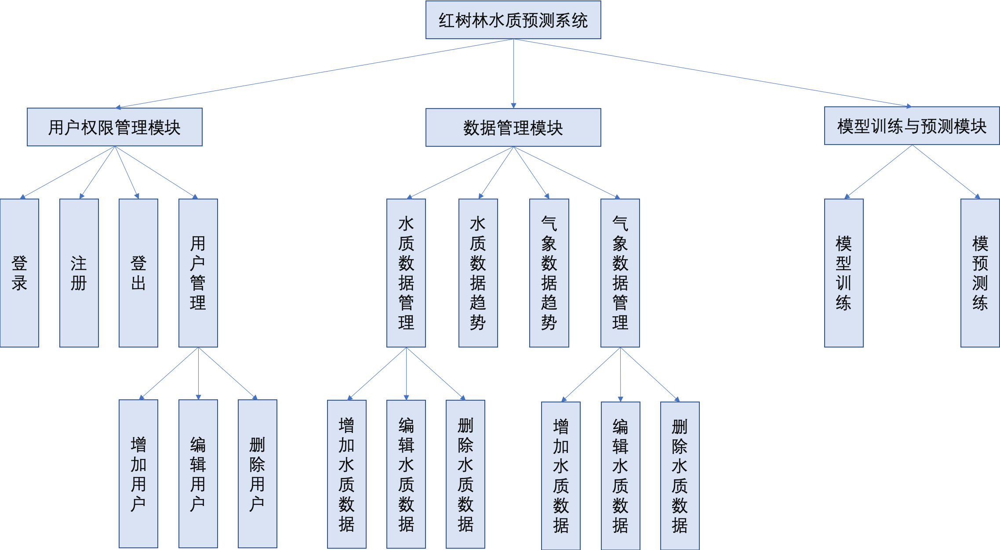
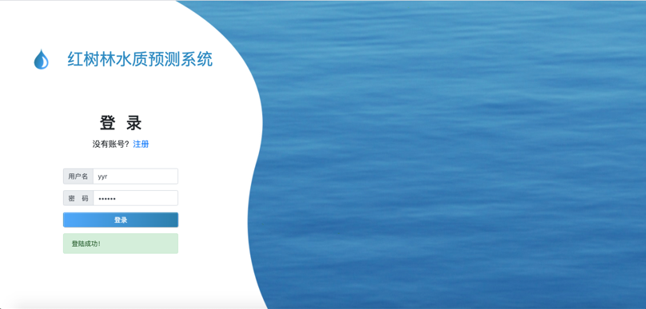
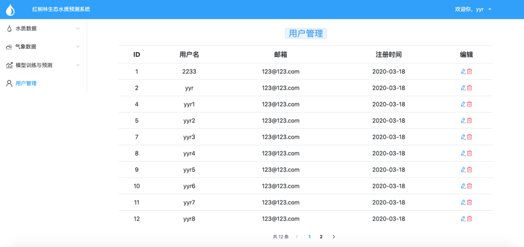
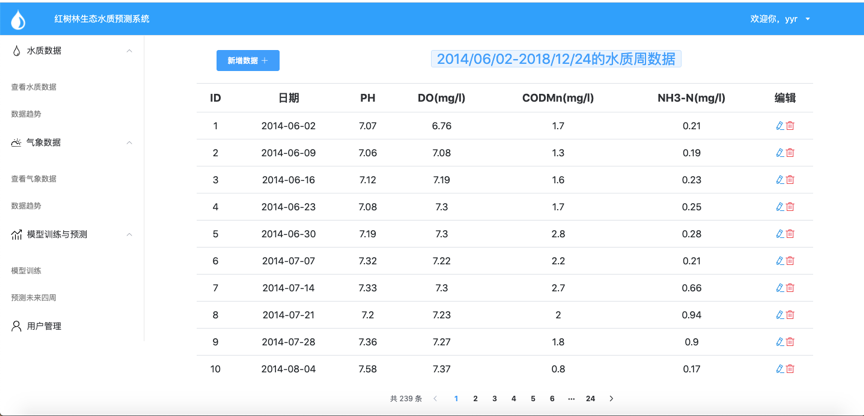
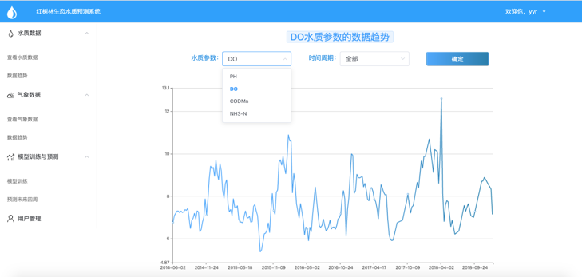
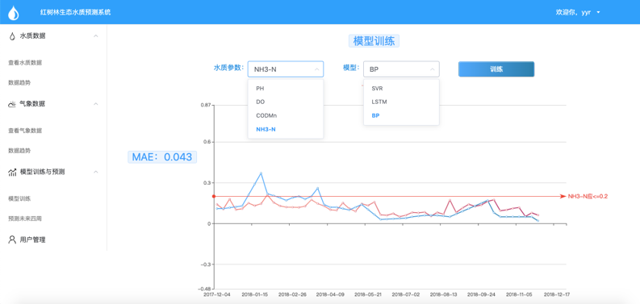
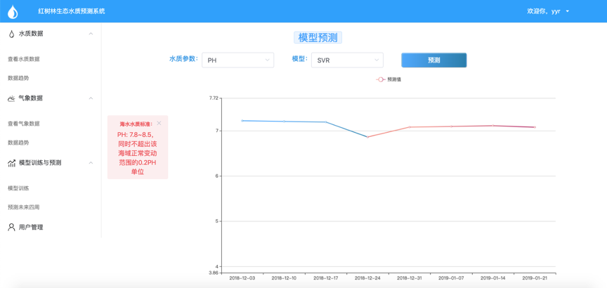

# 水质预测系统
### 系统功能结构图
该系统包括三个模块：分别是用户管理模块、数据管理模块和模型训练与预测模块。

- 用户管理模块：
  - 登录
  - 注册
  - 登出
  - 用户管理
- 数据管理模块：
  - 水质数据趋势查看
  - 水质数据管理
  - 气象数据趋势查看
  - 气象数据管理
- 模型训练与预测模块
  - 模型训练
  - 未来水质预测

  
  ### 部分界面截图
  - 登录
  
  
  - 用户管理
  
  
  - 水质数据管理
  
  
  - 水质趋势查看
  
  
  - 模型训练
  
  
  - 预测
  
  
  
  ### 运行前端项目
  1. 将项目克隆到本地
  2. `npm i ` 安装依赖
  3. `npm start` 运行项目
 
[后端项目](https://github.com/yyruuu/WQPS-backend)：https://github.com/yyruuu/WQPS-backend

